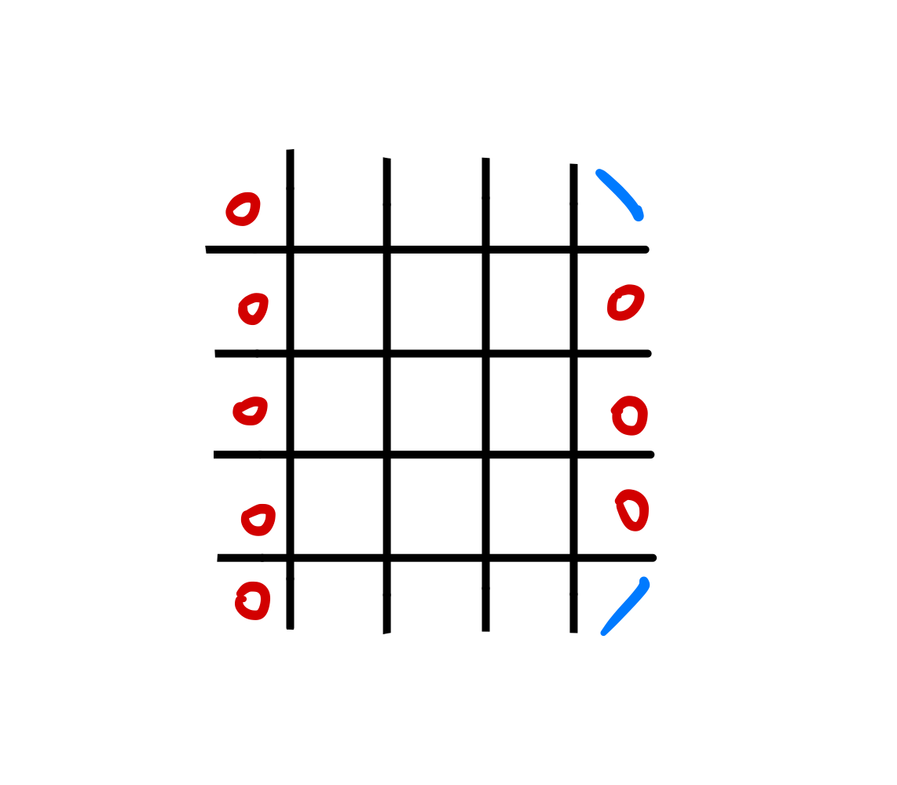

<!-- more -->

今天手感还怪好的四题全部一遍过ww

## A.Sasha and the Beautiful Array

最大减最小

### Code

```cpp
int main()
{
    T = read();
    while (T--) {
        mx = 0, mn = 2e9;
        n = read();
        for (int i = 1; i <= n; i++) a[i] = read(), mx = max(mx, a[i]), mn= min(mn, a[i]);
        printf("%d\n", mx - mn);
    }

    return 0;
}
```

## B.Sasha and the Drawing

每个格子都会有两条对角线经过，捣鼓两下可以发现最多有 $2n - 2$ 个格子贡献为2，此时覆盖 $4n - 4$ 条对角线，剩下角落的两条每条都需要一个格子

以 $n = 5$ 为例：


### Code

```cpp
int main()
{
    T = read();
    while (T--) {
        n = read(), k = read();
        int tn = 4 * n - 4;
        ans = 0;
        if (k <= tn) ans = (k + 1) / 2;
            else ans = tn / 2 + (k - tn);
        printf("%d\n", ans);
    }

    return 0;
}
```

## C.Sasha and the Casino

策略就是假设上一轮输了，这一轮投入的金币应该能保证赢回本还能赚

如果 $x + 1$ 轮需要的金币比本金多就不行

### Code

```cpp
int main()
{
    T = read();
    while (T--) {
        k = read(); x = read(); n = read();
        LL tot = 0, now = 1, ff = 1;
        if (n <= x) {printf("NO\n"); continue;}
        for (int i = 1; i <= x + 1; i++) {
            if (tot >= now * (k - 1)) now += (tot - now * (k - 1)) / (k - 1) + 1;
            tot += now;
            if (tot > n) {ff = 0; break;}
        }
        printf(ff ? "YES\n" : "NO\n");
    }

    return 0;
}
```

## D.Sasha and a Walk in the City

考虑两种情况，一种是从每个叶节点到根结点形成的链上最多只有一个特殊点，用 $f$ 保存，还有一种就是有存在两个关键点的链，用 $ex$ 保存

那么对于以 $x$ 为根的子树，如果不选择 $x$ 为关键点：

1.第一种情况下因为每条链上只有一个关键点，那么经过 $x$ 的路径一定不会包含第三个关键点，$x$ 子树的所有情况可以随意组合，直接将所有子节点的 $f$ 乘起来即可

2.第二种情况下，如果 $x$ 的一棵子树存在这样一条链，其他子树的任意节点都不能成为关键点，只能是空白一种情况，所以把 $ex$ 相加

如果选择 $x$ 成为关键点的话，子树一定不能含链，分为两种情况：

1.除了 $x$ 均为空白，符合第一种情况

2.对于一颗子树的所有不含链且不为空白的可能（即为 $f[son] - 1$ ），加上 $x$ 会构成若干条链，此时其余子树应均为空白。

所以
$f[x] = 1 + \prod_{i \in son[x]} f[i]$


$ex[x] = \sum_{i \in son[x]}(ex[i] + f[i] - 1)$

答案就是 $f[1] + ex[1]$

--------

 $f[i]$ 初始化为 $1$ ，叶节点为 $2$

### Code

```cpp
#include<bits/stdc++.h>
#define LL long long
using namespace std;
const int maxn = 3e5 + 5;
const int P = 998244353;
LL T;
LL n;
LL head[maxn], nxt[maxn << 1], to[maxn << 1], cnt;
LL siz[maxn];
LL f[maxn], ex[maxn];
LL read() {
    LL x = 0, w = 1;
    char ch = 0;
    while (ch < '0' || ch > '9') {
        if (ch == '-') w = -1;
        ch = getchar();
    }
    while (ch >= '0' && ch <= '9') {
        x = x * 10 + ch - 48;
       ch = getchar();
    }
    return x * w;
}
void in(int x, int y) {
    nxt[++cnt] = head[x], head[x] = cnt, to[cnt] = y;
}
void dfs(int cur, int ftr) {
    siz[cur] = 1;
    for (int i = head[cur]; i; i = nxt[i])
        if (to[i] != ftr) {
            dfs(to[i], cur);
            siz[cur] += siz[to[i]];
            f[cur] = (f[cur] * f[to[i]]) % P;
            ex[cur] = (ex[cur] + ex[to[i]] + f[to[i]] - 1) % P;
        }
    f[cur]++, f[cur] %= P;
}
int main()
{
    T = read();
    while (T--) {
        cnt = 0;
        n = read();
        for (int i = 1; i <= n; i++) f[i] = 1, ex[i] = head[i] = 0;
        for (int i = 1; i < n; i++) {
            int x, y;
            x = read(); y = read();
            in(x, y); in(y, x);
        }
        dfs(1, 0);

        printf("%lld\n", (f[1] + ex[1] + P) % P);
    }
    return 0;
}
```

## E.Sasha and the Happy Tree Cutting

一开始没看 $k$ 范围往天天爱跑步上想了，想半天想不出来（

----

对于每条路径，选择的边只可能是深度最浅的两条（或一条）

也比较好证，如果某条边不是任意一条路径的最浅边，它父节点经过的边包含经过该节点的所有边。

然后记录一下每条关键边经过哪几条路径上跑状压dp就行

$f_{i,S}$ 表示前 $i$ 条关键边，路径状态为 $S$ 的最小边数

$f_{i,S} = min(f_{i - 1, S_0} + 1)$ ，其中$S_0$ 是 $S$ 的子集

然后 $f$ 开 $2k * 2^k$ 会爆空间，用滚动数组存下

### Code

```cpp
#include<bits/stdc++.h>
#define LL long long
using namespace std;
const int maxn = 1e5 + 5;
const int maxk = 2e1 + 1;
int T;
int n, k, r1, r2;
int head[maxn], to[maxn << 1], nxt[maxn << 1], cnt;
int v[maxn], f[2][2 << maxk];
int t[maxn], vis[maxn], tot;
int read() {
    int x = 0, w = 1;
    char ch = 0;
    while (ch < '0' || ch > '9') {
        if (ch == '-') w = -1;
        ch = getchar();
    }
    while (ch >= '0' && ch <= '9') {
        x = x * 10 + ch - 48;
       ch = getchar();
    }
    return x * w;
}
void in(int x, int y) {
    nxt[++cnt] = head[x], head[x] = cnt, to[cnt] = y;
}

int fa[maxn], dep[maxn];

void dfs(int cur, int ftr, int depth) {
    fa[cur] = ftr, dep[cur] = depth;
    for (int i = head[cur]; i; i = nxt[i])
        if (to[i] != ftr) dfs(to[i], cur, depth + 1);
}
void up(int x) {
    r2 = r1, r1 = x;
}
int main()
{
    T = read();
    while (T--) {        
        n = read();
        cnt = tot = 0;
        for (int i = 1; i <= n; i++) head[i] = v[i] = vis[i] = 0;
        for (int i = 1; i < n; i++) {
            int x, y;
            x = read(); y = read();
            in(x, y); in(y, x);
        }
        dfs(1, 0, 1);
        k = read();
        for (int i = 1; i <= k; i++) {
            int x, y;
            x = read(); y = read();
            r1 = r2 = 0;
            while (x != y) {
                if (dep[x] > dep[y]) v[x] |= 1 << (i - 1), up(x), x = fa[x];
                    else v[y] |= 1 << (i - 1), up(y), y = fa[y];
            }
            if (!vis[r1]) t[++tot] = r1, vis[r1] = 1;
            if (dep[r1] == dep[r2] && !vis[r2]) t[++tot] = r2, vis[r2] = 1;
        }

        for (int j = 1; j < (1 << k); j++)
            f[0][j] = f[1][j] =1e9;
        f[0][0] = 0;
        for (int i = 1; i <= tot; i++) {
            for (int j = 0; j < (1 << k); j++) {
                if (f[i & 1 ^ 1][j] == 1e9) continue;
                f[i & 1][j] = min(f[i & 1][j], f[i & 1 ^ 1][j]);
                f[i & 1][v[t[i]] | j] = min(f[i & 1][v[t[i]] | j], f[i & 1 ^ 1][j] + 1);
            }
        }
        printf("%d\n", f[tot & 1][(1 << k) - 1]);
    }

    return 0;
}
```