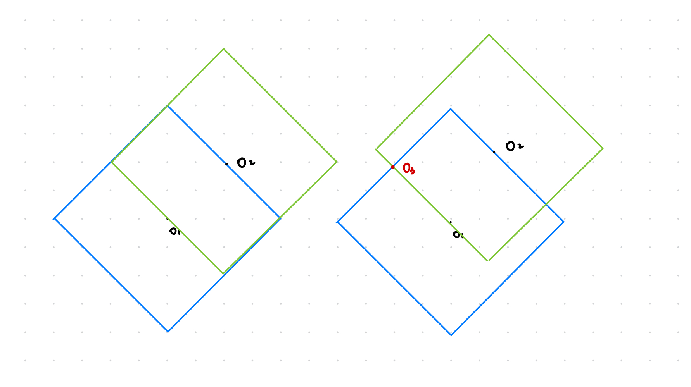

<!-- more -->

最近比较忙想摸一场，赛后看群友上大分没忍住写了下 CDE ，怎么感觉我不打的场都是上分场 :(

## [C - Earning on Bets](https://codeforces.com/contest/1979/problem/C)

仅当 $\Sigma \frac {1} {k_i} < 1$ 时有解

记所有 $k_i$ 的 LCM 为 $M$

对每种情况投入的金币可以是 $\frac {M} {k_i}$ 

**证明：**

题目要求为 $x_i \times k_i > S$

即 $S = \Sigma {x_i} > \Sigma \frac {S} {k_i}$

所以 $\Sigma \frac {1} {k_i} < 1$

按照上述方案，此时 $S = \Sigma \frac {M} {k_i} < M$ （ $S$ 为总投入，$M$ 为收益

### Code

```cpp
#include<bits/stdc++.h>
#define LL long long
using namespace std;
const int maxn = 5e1 + 5;
int T;
int n;
int a[maxn], ans[maxn];
int read() {
    int x = 0, w = 1;
    char ch = 0;
    while (ch < '0' || ch > '9') {
        if (ch == '-') w = -1;
        ch = getchar();
    }
    while (ch >= '0' && ch <= '9') {
        x = x * 10 + (ch ^ 48);
       ch = getchar();
    }
    return x * w;
}
LL gcd(LL a, LL b) {
    return !b ? a : gcd(b, a % b);
}
int main()
{

    T = read();
    while (T--) {
        n = read();
        LL s = 1;
        for (int i = 1; i <= n; i++) a[i] = read(), s = 1ll * s * a[i] / gcd(s, a[i]);

        int cost = 0;
        for (int i = 1; i <= n; i++)
            ans[i] = s / a[i], cost += ans[i];

        if (cost >= s) {
            printf("-1\n");
            continue;
        }

        for (int i = 1; i <= n; i++)
            printf("%d ", ans[i]);

        putchar('\n');
    }


    return 0;
}
```

## [D - Fixing a Binary String](https://codeforces.com/contest/1979/problem/D)

操作等效于把前 $p$ 个字符反转到字符串末尾，那么把一段相同的字符合并只考虑长度，操作最多只能改变两个段的长度

一共有三种合法情况：

1. 末尾长度比 $k$ 小，将中间一段长度大于 $k$ 的掰开，一段为 $k$ ，另一段和末尾拼成 $k$

2. 末尾长度比 $k$ 小，中间也有一段长度小于 $k$ 的，直接翻过去拼成 $k$

3. 只有一段长度为 $2k$ 的，并且和末尾字符不一样，直接掰开

直接合法的特判一下输出 $n$ 就好了

### Code

```cpp
#include<bits/stdc++.h>
#define LL long long
using namespace std;
const int maxn = 2e5 + 5;
int T;
int n, k;
int a[maxn];
int s[maxn], tag[maxn];
int read() {
    int x = 0, w = 1;
    char ch = 0;
    while (ch < '0' || ch > '9') {
        if (ch == '-') w = -1;
        ch = getchar();
    }
    while (ch >= '0' && ch <= '9') {
        x = x * 10 + (ch ^ 48);
       ch = getchar();
    }
    return x * w;
}
int main()
{
    T = read();
    while (T--) {
        n = read(); k = read();
        for (int i = 1; i <= n; i++) scanf("%1d", &a[i]);

        int cnt = 1;
        s[1] = 1, tag[1] = a[1];
        for (int i = 2; i <= n; i++) {
            if (a[i] == a[i - 1]) s[cnt]++;
                else s[++cnt] = 1, tag[cnt] = a[i];
        }

        int ff = 1, s1 = 0, s2 = 0, pos1 = 0, pos2 = 0;
        for (int i = 1; i <= cnt; i++) {
            if (s[i] != k) {
                ff = 0;
                if (!pos1) pos1 = i;
                    else if (!pos2) pos2 = i;
                    else {pos1 = -1; break;}
            }
        }
        if (ff) {
            printf("%d\n", n);
            continue;
        }
        if (pos1 == -1) {
            printf("-1\n"); continue;
        }

        int ans = -1;
        if (!pos2) {
            if (s[pos1] == 2 * k && tag[pos1] != tag[cnt]) {
                ans = pos1 * k;
            }
        }
        if (pos1 && pos2) {
            if (pos2 == cnt && s[pos2] <= k && ((s[pos1] + s[pos2] == k || s[pos1] + s[pos2] == 2 * k) && tag[pos1] == tag[pos2]))
                ans = k * (pos1 - 1) + (k - s[pos2]);
        }
        if (ans < -1) ans = -1;

        printf("%d\n", ans);
    }


    return 0;
}
```

## [E - Manhattan Triangle](https://codeforces.com/contest/1979/problem/E)

众所周知，某一曼哈顿距离围成的是一个转 45° 的正方形

先假设一个点 $O_1$ ，和一个与其曼哈顿距离为 $d$ 的点 $O_2$ 

画画图，可以发现当 $O_2$ 处于 $O_1$ 的斜四向方向时，两个正方形的交集是两条线段；不在斜四向方向时，两个正方形的交集是两个点，其中一个点位于 $O_1$ 的斜四向方向，另一个点位于 $O_2$ 的斜四向方向

是这个样子：

说明满足题意的三角形一定有一条边它的斜率是 $\pm 1$，我们就可以枚举点 $O_1$ ，然后看它的 $(-1, -1)$ , $(-1, 1)$ 两个方向上能不能找到 $O_2$ （就是 $O_1,O_2$ 处于斜四向的情况），如果找到了就按照上面的情况看两条交线段上有没有点

在交线段上找点的话，对于斜率为 $+1$ 的直线，在同一条直线上的点拥有相同的 $b = y - x$，可以按照 $y + x$ 也就是斜率为 $-1$ 时的截距排序，开 $4e5$ 个 `set` 在对应两条线段的 `set` 里找 $x_{O_1} + y_{O_1}$ 到 $x_{O_2} + y _ {O_2}$ 有没有点就行了

斜率为 $-1$ 的直线同理

突然发现这个好像就是曼哈顿距离和切比雪夫距离的转换（

## Code

```cpp
#include<bits/stdc++.h>
#define LL long long
using namespace std;
const int maxn = 2e5 + 5;
const int N = 2e5;
int T;
int n, k;
struct point {
    int x, y;
}p[maxn];
set <pair<int, int>> s[maxn << 1];
int read() {
    int x = 0, w = 1;
    char ch = 0;
    while (ch < '0' || ch > '9') {
        if (ch == '-') w = -1;
        ch = getchar();
    }
    while (ch >= '0' && ch <= '9') {
        x = x * 10 + (ch ^ 48);
       ch = getchar();
    }
    return x * w;
}
int main()
{
    T = read();
    while (T--) {
        n = read(); k = read();
        map <pair<int, int>, int> mp;
        for (int i = 1; i <= n; i++) {
            int x, y;
            x = read(); y = read();
            p[i] = {x, y};
            mp[{x, y}] = i;
            s[y - x + N].insert({x + y, i});
        }

        int ff = 0;
        for (int i = 1; i <= n; i++) {
            auto [x1, y1] = p[i];
            if (mp.find({x1 - k / 2, y1 - k / 2}) != mp.end()) {
                int id = mp[{x1 - k / 2, y1 - k / 2}], b = y1 - x1 + N;
                auto [x2, y2] = p[id];
                if (b + k <= 4e5) {
                    auto it = s[b + k].lower_bound({x2 + y2, 0});
                    if (it != s[b + k].end()) {
                        if (it -> first <= x1 + y1) {
                            ff = 1;
                            printf("%d %d %d\n", i, id, it -> second);
                            break;
                        }
                    }
                }
                if (b >= k) {
                    auto it = s[b - k].lower_bound({x2 + y2, 0});
                    if (it != s[b - k].end()) {
                        if (it -> first <= x1 + y1) {
                            ff = 1;
                            printf("%d %d %d\n", i, id, it -> second);
                            break;
                        }
                    }
                }
            }
        }
        for (int i = 1; i <= n; i++) {
            auto [x, y] = p[i];
            s[y - x + N].erase({y + x, i});
        }
        for (int i = 1; i <= n; i++) {
            auto [x, y] = p[i];
            s[x + y + N].insert({y - x, i});
        }
        for (int i = 1; i <= n; i++) {
            if (ff) break;
            auto [x1, y1] = p[i];
            if (mp.find({x1 - k / 2, y1 + k / 2}) != mp.end()) {
                int id = mp[{x1 - k / 2, y1 + k / 2}], b = y1 + x1 + N;
                auto [x2, y2] = p[id];
                if (b + k <= 4e5) {
                    auto it = s[b + k].lower_bound({y1 - x1, 0});
                    if (it != s[b + k].end()) {
                        if (it -> first <= y2 - x2) {
                            ff = 1;
                            printf("%d %d %d\n", i, id, it -> second);
                            break;
                        }
                    }
                }
                if (b >= k) {
                    auto it = s[b - k].lower_bound({y1 - x1, 0});
                    if (it != s[b - k].end()) {
                        if (it -> first <= y2 - x2) {
                            ff = 1;
                            printf("%d %d %d\n", i, id, it -> second);
                            break;
                        }
                    }
                }
            }
        }
        for (int i = 1; i <= n; i++) {
            auto [x, y] = p[i];
            s[y + x + N].erase({y - x, i});
        }

        if (!ff) printf("0 0 0\n");
    }

    return 0;
}
```